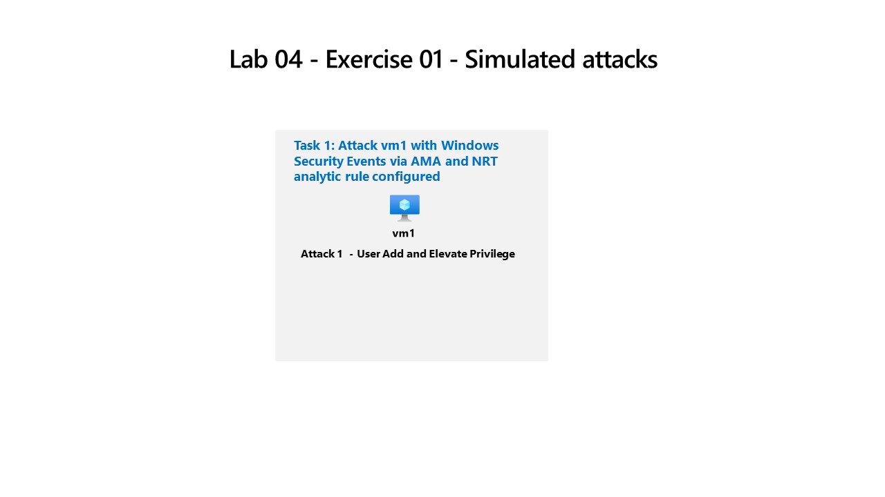

---
lab:
  title: "Exercice\_04\_: Simuler une attaque"
  module: Guided Project - Perform a simulated attack to validate Analytic and Automation rules
---

>**Remarque** : ce labo s’appuie sur les Labs 01, 02 et 03. Pour suivre ce labo, vous devez disposer d’un [abonnement Azure](https://azure.microsoft.com/free/?azure-portal=true). pour lequel vous disposez d’un accès administratif.

## Recommandations générales

- Lors de la création d’objets, utilisez les paramètres par défaut, à moins que des exigences ne requièrent des configurations différentes.
- Ne créez, ne supprimez ou ne modifiez des objets que pour répondre aux exigences énoncées. Des modifications inutiles de l’environnement peuvent avoir un effet négatif sur votre score final.
- S’il existe plusieurs approches pour atteindre un objectif, choisissez toujours celle qui nécessite le moins d’efforts administratifs.

Nous devons vérifier que notre déploiement Microsoft Sentinel reçoit des événements de sécurité et crée des incidents à partir de machines virtuelles qui exécutent Windows.

## Diagramme de l'architecture



## Tâches d'apprentissage

Vous devez effectuer une attaque simulée pour vérifier que les règles d’analytique et d’automatisation créent un incident et l’attribuent au `Operator1`. Vous allez effectuer une attaque `Privilege Escalation` simple sur `vm1`.

## Instructions de l’exercice

### Tâche 1 : Effectuer une simulation d’attaque de réaffection des privilèges

Utilisez des simulations d’attaques pour tester les règles d’analyse dans Microsoft Sentinel. En savoir plus sur la [simulation d’attaque de réaffectation des privilèges](https://github.com/redcanaryco/atomic-red-team/blob/master/atomics/T1078.003/T1078.003.md).

1. Localisez et sélectionnez la machine virtuelle **vm1** dans Azure, puis faites défiler les éléments de menu jusqu’à **Opérations** et sélectionnez **Exécuter la commande**.
1. Dans le volet **Exécuter la commande**, sélectionnez **RunPowerShellScript**.
1. Copiez les commandes ci-dessous pour simuler la création d’un compte Admin dans le formulaire `PowerShell Script` et sélectionnez **Exécuter**.

    ```CommandPrompt
    net user theusernametoadd /add
    net user theusernametoadd ThePassword1!
    net localgroup administrators theusernametoadd /add
    ```

>**Remarque** : assurez-vous qu’il n’y a qu’une seule commande par ligne et que vous pouvez réexécuter les commandes en changeant de nom d’utilisateur.

1. Dans la fenêtre `Output`, vous devriez voir `The command completed successfully` trois fois.

### Tâche 2 : Vérifier qu’un incident est créé à partir de la simulation d’attaque

Vérifiez qu’un incident est créé et qu’il correspond aux critères de la règle d’analyse et de l’automatisation. En savoir plus sur la [gestion des incidents dans Microsoft Sentinel](https://learn.microsoft.com/azure/sentinel/incident-investigation).

1. Dans `Microsoft Sentinel`, accédez à la section de menu `Threat management` et sélectionnez **Incidents**
1. Vous devriez voir un incident qui correspond à `Severity` et `Title` que vous avez configurés dans la règle `NRT` que vous avez créée.
1. Sélectionnez le `Incident` et le volet `detail` s’ouvre.
1. L’affectation `Owner` doit être **Operator1**, créée à partir de `Automation rule`, et `Tactics and techniques` doit être **Réaffection de privilèges** (à partir de la règle `NRT`).
1. Sélectionnez **Afficher tous les détail**s pour voir toutes les capacités `Incident management` et `Incident actions`.
